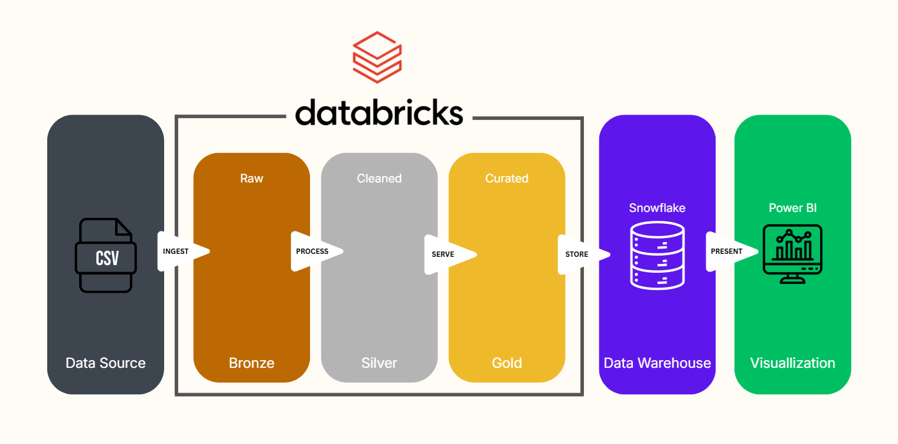
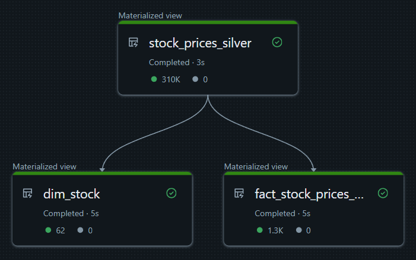
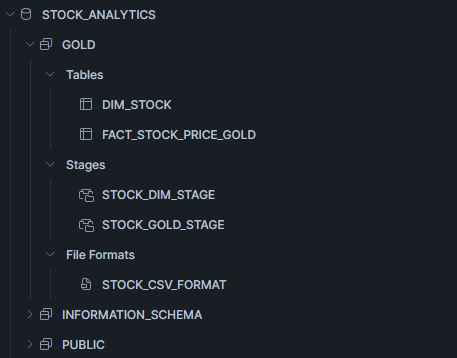
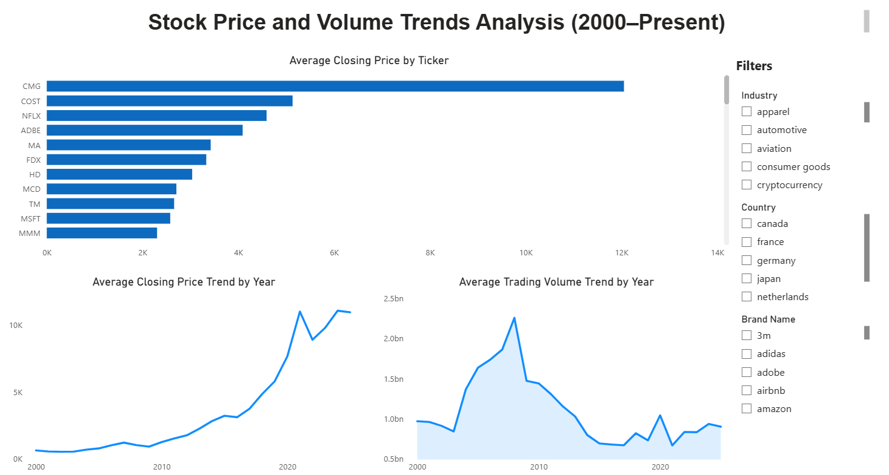

# 📈 Stock Price Analytics Pipeline

An end-to-end data engineering project that ingests historical stock price data, applies the **Medallion Architecture (Bronze → Silver → Gold)** using **Databricks Delta Live Tables (DLT)**, loads curated data into **Snowflake**, and visualizes insights using **Power BI**.

---

##  Project Overview

This project demonstrates a real-world analytics pipeline:

- **Source**: Kaggle world stock prices dataset  
- **Processing**: Databricks (PySpark, Delta Live Tables)  
- **Data Warehouse**: Snowflake  
- **Visualization**: Power BI  
- **Architecture**: Medallion (Bronze, Silver, Gold)  
- **Modeling**: Dimensional (Fact & Dimension tables)

---

##  End-to-End Architecture

---

##  Medallion Architecture

### Bronze Layer
- Raw batch ingestion of stock price data
- Minimal transformation
- Schema-on-read

**Notebook**

---

### Silver Layer (DLT)
- Data cleaning and standardization
- Data quality checks (non-null constraints, type casting)
- Structured, validated dataset

**Notebook**

---

### Gold Layer (DLT)
- Aggregated, analytics-ready tables
- Dimensional modeling applied

**Tables**
- `fact_stock_prices_gold`
- `dim_stock`

**Notebook**

---

##  DLT Pipeline Graph

> Note: Bronze ingestion is executed outside the DLT pipeline.  
> The DLT graph focuses on Silver and Gold transformations.

---

## 📊 Dimensional Model

The Gold layer follows a star schema design:

- **Fact Table**
  - Yearly average closing price
  - Yearly average trading volume
- **Dimension Table**
  - Ticker metadata (brand, industry, country)

This structure supports efficient BI queries and filtering.

---

##  Snowflake Schema

- Database: `STOCK_ANALYTICS`
- Schema: `GOLD`
- Tables:
  - `DIM_STOCK`
  - `FACT_STOCK_PRICE_GOLD`

**SQL Setup**

---

##  Power BI Dashboard

The dashboard includes:
- Average Closing Price by Ticker
- Yearly Average Closing Price Trend
- Yearly Average Trading Volume Trend
- Interactive slicers:
  - Industry
  - Country
  - Brand / Ticker

**Power BI File**

---

##  Skills Demonstrated

- Databricks & PySpark
- Delta Live Tables (DLT)
- Medallion Architecture
- Data Quality enforcement
- Dimensional Modeling (Fact & Dimension)
- Snowflake Data Warehousing
- Data Visualization
- End-to-End Analytics Pipelines

---

##  Notes

- This project is intended for learning and portfolio demonstration
- All datasets are publicly available
- No sensitive or proprietary data is used

